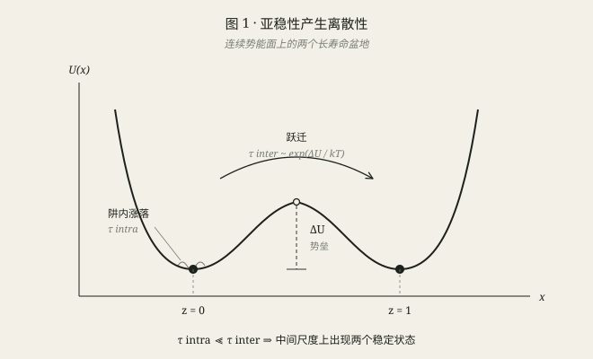
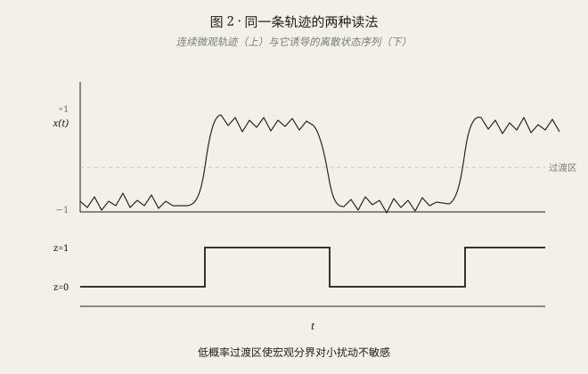
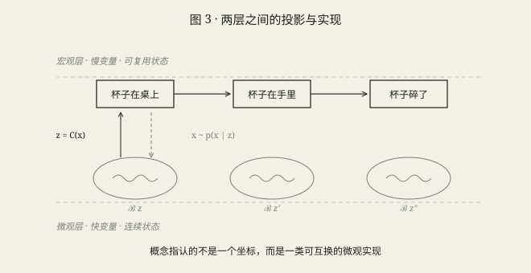
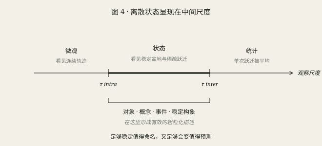

# 词是驻波

### 论离散不是对连续的背叛，而是连续世界在特定尺度上的产物

---

## 一、一个被误设的对立

有一个常见的说法：语言模型处理离散符号，物理世界却是连续的，所以两者之间横着一道鸿沟，需要某种“桥”把它们接起来。

沿着这个说法，人们把连续信号量化成 token，又把 token 解码成连续轨迹，期待两端最终能够对齐。

但这个对立可能从一开始就设错了。

**离散不一定是人类强加给连续世界的网格。很多时候，它恰恰是连续系统在特定时间尺度上自己显露出来的结构。**

词也许不是贴在世界表面的标签，而是我们对这些稳定结构的命名。沿着这个视角，大语言模型与 AlphaFold 虽然不是相同的模型，却可以放进同一个粗粒化框架里理解：它们都绕过了绝大多数微观自由度，直接预测某种稳定、可复用的宏观状态。

这不是说世界在本体上是离散的，也不是说每一个词都对应一个物理势阱。更准确的主张是：

> **当连续系统存在亚稳态与时间尺度分离时，离散状态可以从连续动力学中自然涌现；语言中的一部分概念，可能正是在利用这种结构。**

---

## 二、离散从哪里来：一个双稳态系统

考虑一个连续变量 $x\in\mathbb R$，在双阱势 $U(x)$ 中做过阻尼布朗运动。把迁移率吸收到时间单位里，可以写成

$$\dot x=-U'(x)+\sqrt{2k_BT}\,\xi(t).$$

$x$ 可以取任意实数，轨迹也是连续的。但它的典型行为并不是均匀地游遍整条实轴：绝大部分时间，它只在 $x\approx-1$ 或 $x\approx+1$ 附近抖动；偶尔才跨过中间的势垒，跳到另一边。

于是出现两个时间尺度：

$$\tau_{\rm intra}\quad\text{（阱内弛豫）}\qquad\ll\qquad\tau_{\rm inter}\sim e^{\Delta U/k_BT}\quad\text{（跨阱跃迁）}.$$

当势垒远高于热涨落时，这个比值可以非常大。在两个尺度之间观察，系统就像只有两个状态：

$$z=\begin{cases}0,&x\in\mathcal B_0,\\1,&x\in\mathcal B_1.\end{cases}$$

这里仍然存在一次“划分”：我们需要选定两个盆地 $\mathcal B_0,\mathcal B_1$ 的分界。但这个分界不是任意的。只要它落在概率极低、停留时间极短的过渡区里，长期统计几乎不会随分界面的微小移动而改变。

所以更准确的说法不是“完全没有人为选择”，而是：

$$\boxed{\text{亚稳性让许多合理的离散化在动力学上近似等价。}}$$

同一条轨迹因此有两种读法。微观上，$x(t)$ 处处连续、不断涨落；宏观上，它诱导出一个几乎总停在 0 或 1、偶尔发生跃迁的 $z(t)$。

物理学里还有许多相似结构。连续的弦只能稳定支持特定的驻波模式，于是产生离散音高；电子在连续空间中运动，却只允许特定的稳定能级，于是产生离散谱线。

“词是驻波”当然是一个比喻，而不是说语义真的满足波动方程。这个比喻要表达的是：

> **离散并不总与连续对立。它可以是连续系统在约束、稳定性与尺度分离下允许长期存在的模式。**

---

## 三、词可以是什么

现在把这个观察推到语言上。

我们说“杯子在桌上”。如果坚持最完整的连续描述，它对应的是杯子、桌子和周围环境中天文数字个原子的位形。但这句话只用了几个字。

它显然是有损压缩：我们丢掉了杯子的颜色、温度、毫米级振动以及几乎全部微观细节。可它又不是任意压缩，因为它保留了一件对预测与行动非常稳定的事：杯子属于“在桌上”这个关系状态，而不是“在手里”或“已经碎了”。

可以把它写成

$$z=\text{“杯子在桌上”}\qquad\Longleftrightarrow\qquad x\in\mathcal B_z\subset\mathbb R^{3N}.$$

微观状态始终在变化，但只要它没有离开 $\mathcal B_z$，许多宏观判断就保持不变。要改变这个判断，通常需要一个事件：有人拿起杯子，或者杯子从桌上掉下去。

$$\text{“杯子在桌上”}\longrightarrow\text{“杯子在手里”}\longrightarrow\text{“杯子碎了”}.$$

在这个意义上，词或短语可以被看作对一簇微观状态的命名：

$$z=C(x)\quad\text{是投影、感知与抽象},$$

$$x\sim p(x\mid z)\quad\text{是实现、生成与行动}.$$

但必须保留两个限定。

第一，**词不是盆地本身，而是观察者在任务、身体能力和文化历史中选择的粗粒化坐标。** 世界提供稳定性与可分性，人类决定哪些稳定差异值得命名。雪的状态、颜色的边界、亲属关系的分类，都带有真实结构，也带有语言共同体的选择。

第二，**组合性不要求不同慢变量彼此独立。** 更弱、也更可信的条件是它们具有一定的可分解性和可复用性。“杯子在桌上”与“门开着”可以组合，是因为“对象—位置”和“门—状态”可以作为相对模块化的坐标重复使用；它们可以耦合，却不必每次都从微观世界重新定义。

所以，词不是对连续世界的无损替代。它更像一种被稳定性、可预测性和行动价值共同筛选出来的压缩。

---

## 四、于是 LLM 的位置就清楚了

如果一部分语义概念对应稳定的宏观状态，那么在语言层面建模，就是在慢变量层面建模：

$$\text{微观状态 }x_t\in\mathbb R^{3N}\qquad\xrightarrow{\text{粗粒化}}\qquad\text{语义状态 }z_t.$$

语言模型不直接求解产生一句话的全部物理与神经动力学。它从文本中学习宏观状态之间的关系：“杯子掉下去”以后更可能是“碎了”，而不是“向上飞走”；“某人答应了一件事”会改变后续行动的约束。

这些规律在语义层已经成立，不必每次重新积分牛顿方程。

这也给出了一个解释：为什么仅从文本训练的模型，仍能学到大量关于物理世界的知识。文本不是世界的完整记录，却是人类长期观察之后留下的粗粒化轨迹。它已经把大量微观变化压成对象、事件、关系和因果规则。

$$\boxed{\text{词汇与语义范畴，是一张经过长期集体搜索形成的粗粒化地图。}}$$

不过这里必须区分三个东西：

- 自然语言中的词；
- 模型内部形成的语义状态；
- tokenizer 切出的 subword token。

它们不是同一个层次。现代 LLM 的计算单元往往是词片甚至字节片段，一个 token 未必有独立语义。本文的主张不是“每个 tokenizer token 都对应一个世界盆地”，而是：**模型可以从离散 token 序列中学习比 token 本身更高层的、相对稳定的语义状态。**

这样说以后，“最难的离散化已经被语言解决”也要稍微收紧。人类语言确实预先提供了非常强的宏观坐标，但它们并不完美：有些边界模糊，有些概念随文化改变，有些重要状态根本没有现成的词。LLM 继承了这张地图，也必须在内部修补它。

---

## 五、AlphaFold 和 LLM：不是同一种模型，但有同一种粗粒化结构

AlphaFold 从氨基酸序列预测三维结构。它的输出是连续坐标，所以直觉上似乎比 LLM 更“物理”、更接近连续世界。

但 AlphaFold 主要回答的是

$$\text{sequence}\longrightarrow\text{一个最可能的结构构型},$$

而不是蛋白质如何随真实时间运动。它擅长预测稳定结构，却不直接给出折叠路径、构象转换速率或完整的热力学系综。

从粗粒化视角看，可以作这样的对照：

$$\text{AlphaFold：预测一个占优势的稳定构型代表},$$

$$\text{LLM：预测语义状态与事件之间的转移关系}.$$

两者的架构、训练目标和输出空间当然不同，因此不能在字面上叫作“同一种模型”。它们相似的地方在于：**都利用了宏观层的稳定结构，而没有显式模拟产生这些结构的全部微观时间演化。**

对 AlphaFold 尤其要谨慎。预测坐标不等于严格求出了自由能盆地，实验结构也不是“某一瞬间的真实坐标”：晶体学模型来自对电子密度的空间与时间平均，NMR 常以结构集合表达约束。但实验与预测得到的结构，都只覆盖蛋白质构象系综的一部分。

因此，最稳妥的结论是：

> **LLM 与 AlphaFold 不是同一类算法，却可以被看作两个不同领域里的粗粒化状态预测器。**

---

## 六、离散性只存在于一个尺度窗口

回到开头的“离散模型与连续世界”。真正该比较的不是两种本体，而是三种观察尺度：

$$\text{观察尺度}<\tau_{\rm intra}\quad\Rightarrow\quad\text{看见连续的微观轨迹},$$

$$\tau_{\rm intra}\ll\text{观察尺度}\ll\tau_{\rm inter}\quad\Rightarrow\quad\boxed{\text{看见稳定状态与稀疏跃迁}},$$

$$\text{观察尺度}\gg\tau_{\rm inter}\quad\Rightarrow\quad\text{单次跃迁被平均，只剩状态占据分布}.$$

长时间观察不会让底层系统“重新变成连续”。变化的是描述对象：我们不再追踪某一次 $0\to1$ 跃迁，而是研究各状态的占据概率、平均通量和稳态分布。

离散状态最清楚地显现于中间窗口：它们足够稳定，值得命名；又偶尔改变，值得预测。许多对象、事件和概念恰好位于这个尺度上。

因此，LLM 用离散 token 建模连续世界，不必被视作一个先天错误。离散表示可能是一种有效的尺度选择。真正的问题不是“离散还是连续”，而是：

$$\boxed{\text{所选的离散状态，是否对应任务所需的慢变量？}}$$

---

## 七、这个和解有一个明确的代价

在慢变量层上，我们能较容易地得到状态、状态之间的关系以及哪些状态更常见，却不一定能得到准确的跃迁速率。

$$\text{盆地的位置与体积}\quad\Rightarrow\quad\text{哪些状态存在、各占多少},$$

$$\text{势垒的高度与过渡通道}\quad\Rightarrow\quad\text{状态怎样转换、转换多快}.$$

在最简单的 Kramers 图景里，跃迁率具有指数依赖：

$$k\propto e^{-\Delta U^\ddagger/k_BT},$$

前因子还取决于局部曲率、摩擦和扩散。速率最敏感的信息，往往恰好位于系统很少停留的过渡区，而不是稳定盆地内部。

所以：

- LLM 可以知道“杯子从高处掉落可能会碎”，却未必能从静态文本准确恢复具体材料、具体高度下的破裂概率和时间尺度；
- AlphaFold 可以给出很好的结构预测，却不直接回答折叠需要多久、两个构象之间转换多频繁。

这不是简单增加模型规模就必然能解决的问题。**仅有稳定状态的静态样本，通常不足以识别唯一的动力学。** 同一个平衡分布可以对应不同的摩擦、扩散与跃迁速率。

要拿回时间，需要额外信息：真实的时间序列、转移事件、动力学实验，或者足够可信的微观机制与模拟。并不一定非要保存每个快变量，但必须有能够约束速率的数据。

---

## 八、更根本的开放问题：如果没有清晰的盆地呢

上面的论证依赖一个前提：

$$\tau_{\rm intra}\ll\tau_{\rm inter}.$$

这个条件并不普遍成立。

有些系统的能量景观崎岖而连绵，没有少数清晰盆地，只有一大片缓慢变化的高维流形。内在无序蛋白、玻璃态以及许多强非平衡系统都更接近这种情况。在那里，离散化可能不是发现已有结构，而是在为计算方便强加结构。

语言里也有类似区域：情绪的浓淡、论证的强弱、审美偏好、颜色渐变。它们更像连续坐标，离散词汇只能给出局部刻度。词的边界有时清晰，有时模糊；有些类别近似盆地，有些更像流形上的方向。

因此，这个视角的正确形式不是“世界是离散的”，而是

$$\boxed{\text{世界在存在稳定等价类与尺度分离的地方，允许有效的离散描述。}}$$

“是否存在这样的结构”原则上可以检验：看候选状态是否具有长停留时间，状态内是否快速混合，状态间跃迁是否稀疏，以及换一个合理分界后宏观动力学是否稳定。

这也给机器学习留下了一个更具体的问题：不要先假设词表或 latent state 必然正确，而要测量它是否真的产生了时间尺度分离和近似闭合的宏观动力学。

---

## 九、结语

弦是连续的，但只有某些模式能稳定存在，于是我们听见离散的音高。世界的微观状态连续变化，但某些关系与构型能在很长时间里保持，于是我们给它们名字。

在这个意义上：

> **词不是强加给世界的均匀网格，更像世界的稳定结构与人类任务共同选择出的驻波。**

“驻波”这个比喻最有价值的地方，不是把语言物理化，而是改变提问方式。我们不再问离散模型如何跨越一条本体论鸿沟，而是问：

$$\text{哪些宏观模式足够稳定，可以被命名？}$$

$$\text{哪些微观差异可以忽略，哪些会改变未来？}$$

$$\text{状态之间的势垒和时间，又该怎样补回来？}$$

LLM 与 AlphaFold 都展示了在稳定状态层建模的力量，也共同暴露了这层描述的边界：状态不等于路径，结构不等于动力学，知道“是什么”不等于知道“怎么变、多久变”。

下一步不是简单地让静态模型“更连续”，而是补上粗粒化按定义容易丢掉的另一半：

$$\boxed{\text{势垒、通量与时间。}}$$

---

### 延伸阅读

- [Jumper et al., *Highly accurate protein structure prediction with AlphaFold*](https://www.nature.com/articles/s41586-021-03819-2)
- [Mardt et al., *VAMPnets for deep learning of molecular kinetics*](https://www.nature.com/articles/s41467-017-02388-1)
- H. A. Kramers, *Brownian motion in a field of force and the diffusion model of chemical reactions* (1940)
- 关于蛋白质动力学与构象系综：结构预测回答稳定构型，时间分辨实验与动力学模型回答状态如何转换
